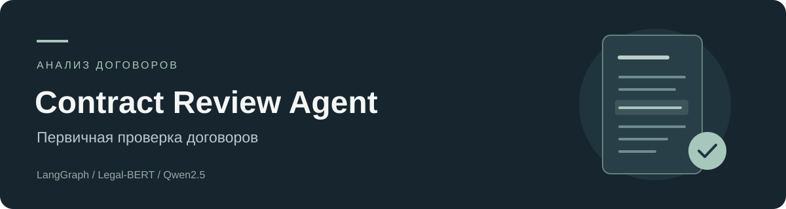

# Contract Review Agent

Программа, которая читает договор и подсказывает юристу, на что обратить внимание. Она находит важные
пункты (например, штрафы, автопродление, ограничение ответственности), объясняет их простыми словами
и показывает цитату из договора, чтобы можно было сразу проверить.

Данные для обучения: [CUAD](https://github.com/TheAtticusProject/cuad), это 510 английских договоров,
в которых юристы вручную отметили пункты. Я взял 12 пунктов, которые важнее всего для бизнеса.

## Содержание

- [Как это работает](#как-это-работает)
- [Структура проекта](#структура-проекта)
- [Результаты](#результаты)
- [Сколько это может сэкономить](#сколько-это-может-сэкономить)
- [Как запустить](#как-запустить)

## Как это работает

Договор проходит по шагам:

1. Текст режется на небольшие куски.
2. Модель Legal-BERT смотрит на каждый кусок и понимает, какие пункты в нём есть.
3. По простым правилам каждому найденному пункту ставится уровень риска: низкий, средний или высокий.
4. Языковая модель Qwen2.5 7B (запускается через Ollama) коротко пересказывает пункт и приводит цитату.
5. Проверяющий шаг смотрит, что цитата правда есть в договоре. Если нет, пересказ делается заново (до 2 раз).
   Если всё равно не получилось, договор помечается «нужна проверка юристом».

Шаги связаны через LangGraph.

## Структура проекта

```
contract-review-agent/
├── README.md
├── requirements.txt
├── data/
│   ├── CUADv1.json
│   ├── windows.parquet
│   └── legalbert_best/
├── reports/
│   ├── baseline_tfidf.csv
│   ├── legalbert.csv
│   ├── agent_eval.jsonl
│   ├── agent_contract_level.csv
│   └── agent_summary.json
└── src/
    ├── config.py
    ├── data_prep.py
    ├── baseline.py
    ├── train.py
    ├── risk.py
    ├── pipeline.py
    ├── run_agent.py
    ├── eval_agent.py
    ├── metrics.py
    ├── roi.py
    └── app.py
```

### Папки

| Папка | Что в ней |
|---|---|
| `data/` | Данные и обученная модель. |
| `reports/` | Результаты замеров: таблицы с метриками. |
| `src/` | Весь код проекта. |

### Файлы в `data/`

| Файл | Что это |
|---|---|
| `CUADv1.json` | Исходный датасет CUAD с договорами и разметкой. Скачивается вручную, см. [Как запустить](#как-запустить). |
| `windows.parquet` | Договоры, нарезанные на куски с метками. Создаётся командой `data_prep.py`. |
| `legalbert_best/` | Дообученная модель Legal-BERT. Создаётся командой `train.py`. |

### Файлы в `reports/`

| Файл | Что это |
|---|---|
| `baseline_tfidf.csv` | Метрики простого baseline по каждому пункту. |
| `legalbert.csv` | Метрики Legal-BERT по каждому пункту, плюс пороги, которые использует агент. |
| `agent_eval.jsonl` | Что агент нашёл в каждом тестовом договоре: пункты, время, число повторов. |
| `agent_contract_level.csv` | Метрики агента по каждому пункту на уровне договора. |
| `agent_summary.json` | Итоговые цифры агента и расчёт экономии. Их показывает веб-интерфейс. |

### Файлы в `src/`

| Файл | Что делает |
|---|---|
| `config.py` | Общие настройки: пути, список из 12 пунктов, размер кусков текста. |
| `data_prep.py` | Режет договоры на куски, ставит метки и делит договоры на train, val и test. |
| `baseline.py` | Простая модель для сравнения (TF-IDF + логистическая регрессия). |
| `train.py` | Дообучает Legal-BERT и считает его метрики на тесте. |
| `risk.py` | Правила, по которым найденному пункту ставится уровень риска. |
| `pipeline.py` | Сам агент: все шаги и связи между ними на LangGraph. |
| `run_agent.py` | Разбор одного договора из консоли. |
| `eval_agent.py` | Прогоняет агента по всем тестовым договорам и сохраняет результат. |
| `metrics.py` | Считает итоговые метрики агента и экономию по результатам `eval_agent.py`. |
| `roi.py` | Формула расчёта экономии и допущения для неё. |
| `app.py` | Веб-интерфейс на Streamlit. |

## Результаты

Проверял на 77 договорах, которых не было в обучении.

Как хорошо модель находит пункты в кусках текста:

| Модель | F1 |
|---|---|
| Простой baseline (TF-IDF + логистическая регрессия) | 0.596 |
| Legal-BERT после дообучения | 0.730 |

Как хорошо агент находит пункты в договоре целиком (вопрос «есть такой пункт или нет»):

| Метрика | Значение |
|---|---|
| Точность (precision) | 0.845 |
| Полнота (recall) | 0.910 |
| F1 | 0.876 |
| Пересказов с подтверждённой цитатой | 98.1% |
| Договоров, которые ушли юристу на проверку | 6 из 77 |
| Время на один договор (GTX 1660 Super) | около 36 секунд |

Цифры по каждому пункту отдельно лежат в `reports/agent_contract_level.csv` и `reports/legalbert.csv`.

## Сколько это может сэкономить

Это расчёт, а не результат реального внедрения. Полноту (recall) я взял из замеров выше, остальные
цифры придуманы для примера, их можно поменять в `src/roi.py`:

- 200 договоров в месяц;
- юрист тратит 1,5 часа на ручной разбор одного договора;
- с помощью агента проверка занимает 0,4 часа;
- час юриста стоит 2500 руб.;
- пропущенный важный риск обходится в 40 000 руб., и важным оказывается каждый десятый пропуск.

Получается, что за месяц экономится около 220 часов работы юриста и около 189 000 руб.
Это 25% от 750 000 руб., которые уходят на ручной разбор. Стоимость пропущенных рисков уже вычтена.

## Как запустить

Нужны Python, PyTorch с поддержкой CUDA и Ollama с моделью `qwen2.5:7b`.

Сначала скачайте датасет: файл `data.zip` из [репозитория CUAD](https://github.com/TheAtticusProject/cuad),
распакуйте из него `CUADv1.json` в папку `data/`.

```bash
pip install -r requirements.txt
cd src
python data_prep.py     # готовит данные
python baseline.py      # простой baseline для сравнения
python train.py         # обучение Legal-BERT, около 1,5 часа на GTX 1660 Super
python eval_agent.py    # прогон агента по тестовым договорам
python metrics.py       # считает метрики и экономию
python run_agent.py     # разбор одного договора в консоли
streamlit run app.py    # веб-интерфейс
```

Обучение идёт в fp32, потому что на GTX 1660 Super с fp16 оно получается в 5 раз медленнее.
